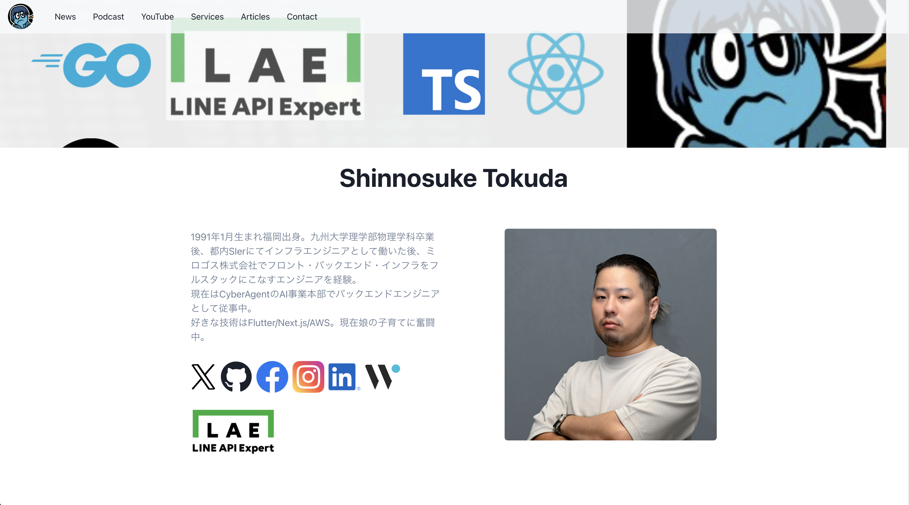

# portfolio

This is tokku's portfolio repository.



---

[tokku's portfolio](https://www.tokku-tech.dev/)


---

## Requirements

| runtime | version             |
| ------- | ------------------- |
| node    | see `.node-version` |
| yarn    | 1.22.22             |

## Getting Started

package install

```bash:
yarn install
```

prepare for local

```bash:
cp -pr .env.sample .env
# please override environment variables
```

start local server

```bash:
yarn dev
```

- testing

```bash
# lint
yarn lint

# unit test
yarn test
```
