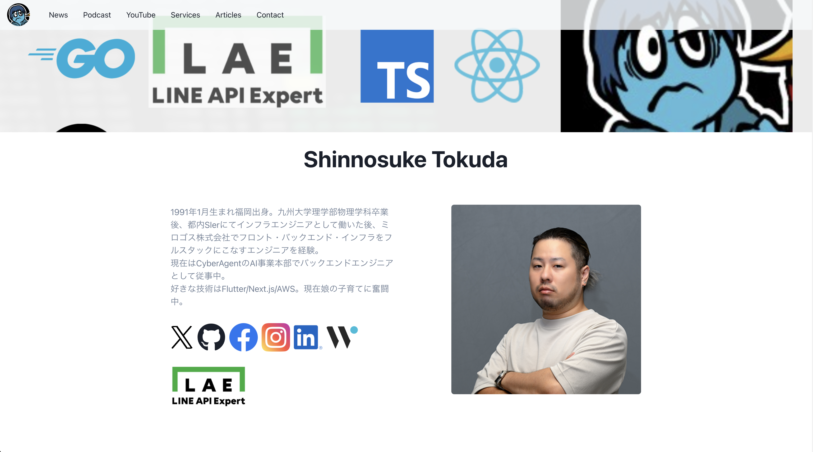

# portfolio

This is tokku's portfolio repository.



---

[tokku's portfolio](https://www.tokku-tech.dev/)


---

## Requirements

| runtime | version                                     |
| ------- | ------------------------------------------- |
| node    | see `.node-version`                         |
| pnpm    | pinned via `packageManager` in package.json |

Enable pnpm on your machine with `corepack enable` (run once). Corepack ships with Node, so no separate install is needed.

## Getting Started

package install

```bash
pnpm install
```

prepare for local

```bash
cp -pr .env.sample .env
# please override environment variables
```

start local server

```bash
pnpm dev
```

- testing

```bash
# lint
pnpm lint

# unit test
pnpm test
```
