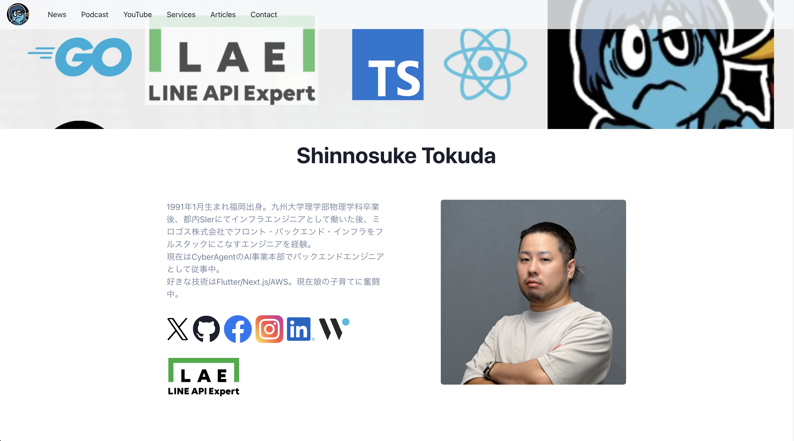

# portfolio

Source code for tokku's portfolio site: **https://www.tokku-tech.dev/**

The top page introduces tokku and features podcasts, YouTube, services, recent articles (aggregated from Zenn, Qiita, and note.com), and contact links. The site also has a full article list at `/articles` and publishes the Twilight Blade brand guidelines at [`/brand`](https://www.tokku-tech.dev/brand).




Tech stack: Next.js (Pages Router), TypeScript, Tailwind CSS v3, Jest, pnpm. Deployed on Vercel (preview on PRs, production on merge to `main`).

## Requirements

| runtime | version                                                     |
| ------- | ----------------------------------------------------------- |
| node    | see `.node-version` (also `engines.node` in `package.json`) |
| pnpm    | see `packageManager` in `package.json`                      |

Versions are bumped by Renovate, so they are intentionally not written here. Enable pnpm once per machine with `corepack enable`; Corepack ships with Node and picks up the pinned pnpm version.

## Getting started

```bash
corepack enable        # once per machine
pnpm install           # also activates the git hooks in .githooks/
cp .env.sample .env    # then fill in the values
pnpm dev               # http://localhost:3000
```

Environment variables (`NEXT_PUBLIC_ENVIRONMENT`, `NEXT_PUBLIC_GA_ID`, and the server-only `QIITA_TOKEN`) are listed in `.env.sample` and explained in [CLAUDE.md](./CLAUDE.md#environment-variables).

## Commands

| command      | what it does               |
| ------------ | -------------------------- |
| `pnpm dev`   | start the dev server       |
| `pnpm build` | production build           |
| `pnpm start` | serve the production build |
| `pnpm lint`  | lint and formatting check  |
| `pnpm test`  | run unit tests (Jest)      |

CI runs `lint`, `test`, and `build` on every PR to `main`.

## Contributing

`main` is PR-only; local hooks reject commits on `main` and pushes to it. Work on a branch and open a PR.

## Further reading

- [CLAUDE.md](./CLAUDE.md) — architecture, directory layout, conventions, and git workflow (written for AI agents, but the most detailed reference for humans too)
- [brand/brand.md](./brand/brand.md) — Twilight Blade design system: colors, typography, DO / DO NOT rules
- [openspec/](./openspec/) — specifications (`specs/`) and change proposals (`changes/`) tracked with OpenSpec
