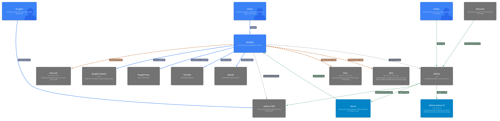
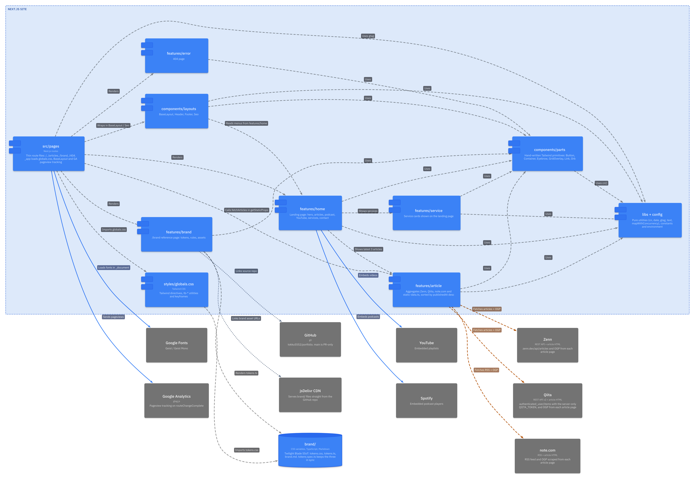
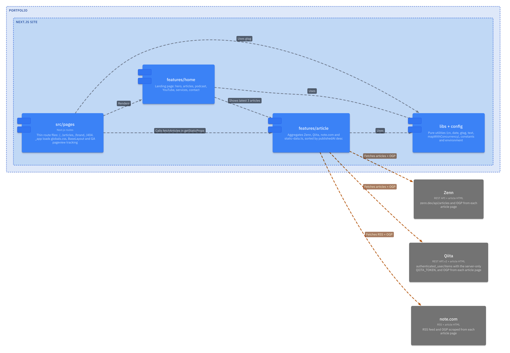
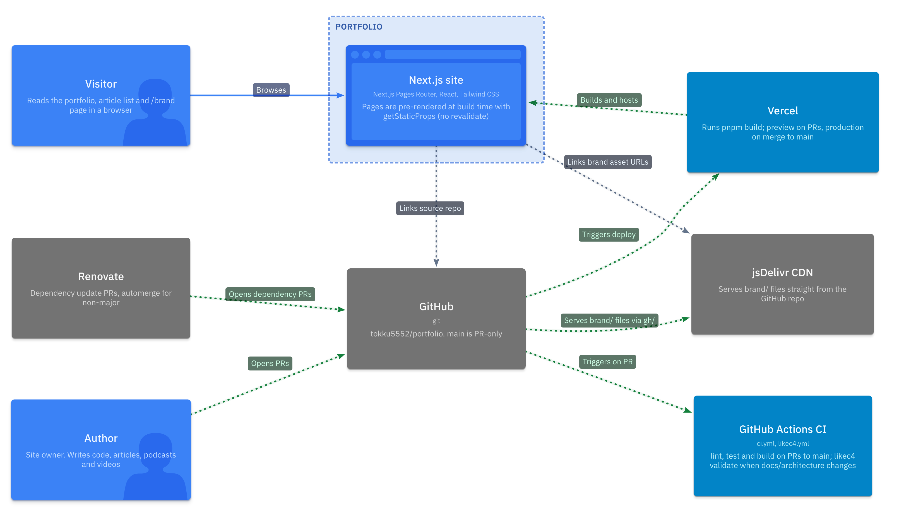
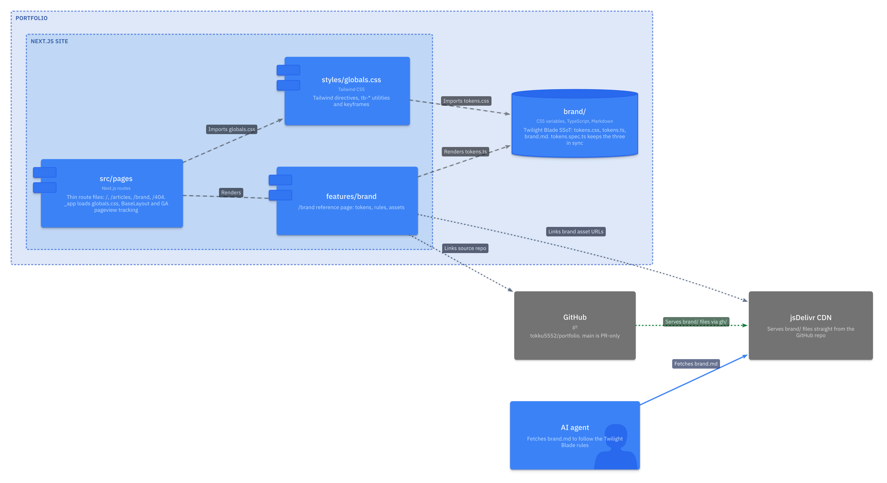

# Architecture

Architecture diagrams of this repository, written in [LikeC4](https://likec4.dev). The `.c4` files are the source; the PNGs under `images/` are exported from them.

| File                 | Contents                                                    |
| -------------------- | ----------------------------------------------------------- |
| `likec4.config.json` | Project config. Scopes the LikeC4 project to this directory |
| `spec.c4`            | Element and relationship kinds                              |
| `model.c4`           | Elements and relationships                                  |
| `views.c4`           | Diagram definitions                                         |
| `images/*.png`       | Exported diagrams (one per view)                            |

## Reading the arrows

| Arrow         | Kind        | Meaning                                                                         |
| ------------- | ----------- | ------------------------------------------------------------------------------- |
| Amber, dashed | `buildtime` | API, RSS and article HTML fetched only while `next build` runs `getStaticProps` |
| Blue, solid   | `runtime`   | Loaded or called by the visitor's browser                                       |
| Green, dotted | `delivery`  | Pull requests, CI and deploys                                                   |
| Muted, dotted | `hyperlink` | A link on a page; nothing is loaded until the visitor clicks it                 |
| Gray, dashed  | (none)      | Imports between code modules                                                    |

Article thumbnails are the exception to build-time only: the article list renders each article's `og:image` URL in an ``, so the visitor's browser loads those images from the external hosts.

## Diagrams

### System context

Who uses the site and which external services it depends on.



### Next.js site modules

Code modules under `src/` and how they use each other and outside services.



### Article aggregation (build time)

Article lists and OGP data from Zenn, Qiita and note.com are fetched only at build time. `QIITA_TOKEN` is needed only there.



### Build and delivery

From a pull request to the deployed site.



### Brand SSoT (Twilight Blade)

Where the `brand/` tokens are consumed.



## Editing

LikeC4 is run through `pnpm dlx`, not installed as a devDependency: it requires React 19 while the site uses React 18. Use the same version as `LIKEC4_VERSION` in `.github/workflows/likec4.yml`.

```bash
# Preview in the browser with live reload
pnpm dlx likec4@1.59.3 start docs/architecture

# Validate (CI runs this on PRs that touch docs/architecture/)
pnpm dlx likec4@1.59.3 validate docs/architecture

# Re-export the PNGs after changing the model or views
pnpm dlx likec4@1.59.3 export png --theme light -o docs/architecture/images docs/architecture
```

The first `export png` downloads a headless Chromium through Playwright. likec4 expects Node.js 22.22.3 or newer; older patch versions print an engine warning.

CI only validates the source. It does not check that the PNGs match it, so re-export them in the same PR when you change the model or views.
